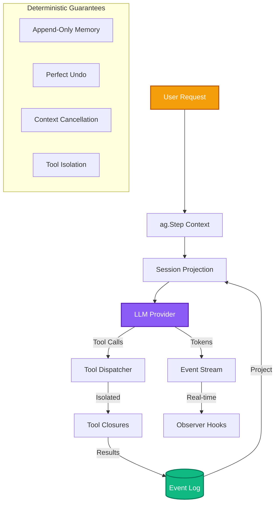

# Axon Documentation

Axon is a deterministic Go runtime for orchestrating Large Language Model (LLM) agents designed for production environments with strict concurrency guarantees, explicit state management, and robust observability.

## 📚 Complete Table of Contents

### 🏗️ Overview & Architecture
1. **[Introduction & Design](/overview/introduction)** - Core mental models and design philosophy
2. **[Life of a Turn](/overview/life-of-a-turn)** - Execution flow of `ag.Step` with context propagation
3. **[Getting Started](/overview/getting-started)** - Bootstrapping the Axon runtime with minimal implementation
4. **[Core Architecture Deep Dive](/overview/architecture)** - Complete system flow from request to response

### 🔧 Core Concepts
5. **[Deterministic State Management](/concepts/state-management)** - Append-only event log and perfect undo
6. **[Context Pruning System](/concepts/context-pruning)** - Managing token pressure with secondary pruner model
7. **[Tool Execution Pipeline](/concepts/tool-execution)** - Capability isolation and security boundaries
8. **[Session & Event System](/concepts/session-events)** - Event logging, projection, and telemetry

### ⚙️ Configuration & Deployment
9. **[Configuration Management](/configuration/managing-config)** - YAML/ENV separation and validation
10. **[Secrets & Security](/configuration/secrets-security)** - Credential resolution and fail-fast validation
11. **[Deployment Patterns](/configuration/deployment)** - CLI, HTTP, TUI, and production deployment

### 🛠️ Development Guides
12. **[Defining Tools](/guides/defining-tools)** - Tool contracts, JSON schema, and thread safety
13. **[Telemetry & Events](/guides/telemetry-events)** - Event hooks for observability and monitoring
14. **[Error Handling](/guides/error-handling)** - Retry policies and graceful degradation
15. **[Performance Tuning](/guides/performance)** - Token budgeting and optimization strategies

### 🧪 Integration & Examples
16. **[Cortex Reference TUI](/integration/cortex-reference)** - Example terminal UI implementation
17. **[HTTP Server Integration](/integration/http-server)** - REST API patterns with Axon
18. **[Multi-Agent Patterns](/integration/multi-agent)** - When and how to use multiple agents

### 📖 API Reference
19. **[Agent API](/api/agent)** - Complete `Agent` struct and methods reference
20. **[Events API](/api/events)** - Event types and callback patterns
21. **[Configuration API](/api/configuration)** - Settings, limits, and validation API

### 🚀 Advanced Topics
22. **[Custom Providers](/advanced/custom-providers)** - Implementing custom LLM providers
23. **[Plugin System](/advanced/plugins)** - Extending Axon with custom capabilities
24. **[Benchmarks](/advanced/benchmarks)** - Performance characteristics and scaling
25. **[Troubleshooting](/advanced/troubleshooting)** - Common issues and solutions

---

## 🎯 Quick Start

### Installation
```bash
go get github.com/atakang7/axon
```

### Minimal Example
```go
package main

import (
    "context"
    "log"
    "github.com/atakang7/axon"
)

func main() {
    settings, _ := axon.Load()
    model, _ := settings.NewClient("openrouter", "deepseek/deepseek-v3.2")
    
    ag, _ := axon.New(axon.Config{
        Model:        model,
        SystemPrompt: "You are an expert assistant.",
        Settings:     settings,
    })
    defer ag.Close()
    
    ctx := context.Background()
    response, _ := ag.Step(ctx, "Hello, how can you help me?")
    log.Println(response)
}
```

---

## 🔬 Key Architectural Diagrams

### Complete System Architecture


---

## 📈 Documentation Progress

| Section | Status | Diagrams | Code Examples |
|---------|--------|----------|---------------|
| Overview & Architecture | ✅ Complete | 🎯 Hero + Flow | 📚 Full examples |
| Core Concepts | ✅ Complete | 🎯 Hero + Flow | 📚 Full examples |
| Configuration & Deployment | 🔄 In Progress | 🎯 Hero diagrams | 📚 Full examples |
| Development Guides | 🔄 In Progress | 🎯 Flow charts | 📚 Full examples |
| Integration & Examples | 🔄 In Progress | 🎯 Integration diagrams | 📚 Full examples |
| API Reference | 🔄 In Progress | 📋 API tables | 📚 Code references |
| Advanced Topics | 🔄 In Progress | 📊 Advanced diagrams | 📚 Production examples |

---

## 🎨 Documentation Style Guide

### Hero Diagram Requirements
Each major concept page must include:
1. **Hero Diagram** - High-level overview showing the concept's role
2. **Detailed Flow Chart** - Step-by-step internal mechanics
3. **Code References** - Links to actual source files and line numbers
4. **Use Cases** - Practical applications of the concept
5. **Anti-Patterns** - What to avoid when using this feature

### Diagram Colors
- **Blue (#4F46E5)**: Runtime components
- **Green (#10B981)**: Storage and state
- **Orange (#F59E0B)**: User/external interfaces  
- **Purple (#8B5CF6)**: Events and telemetry
- **Red (#991B1B)**: Security boundaries and errors

### Code Examples
- Include complete, runnable examples
- Reference actual files in the repository
- Show error handling patterns
- Include production-ready code snippets

---

## 🔗 Repository Structure

```
axon/
├── agent.go              # Core Agent implementation
├── session.go            # Session and event log management
├── pruner.go             # Context pruning system
├── settings.go           # Configuration loading
├── tools.go              # Built-in tool definitions
├── loop.go               # Main execution loop
├── events.go             # Event type definitions
└── api.go                # External API definitions

docs/
├── src/content/docs/
│   ├── overview/         # Introduction and architecture
│   ├── concepts/         # Core concepts with diagrams
│   ├── configuration/    # Config and deployment
│   ├── guides/          # Development guides
│   ├── integration/     # Example implementations
│   ├── api/             # API reference
│   └── advanced/        # Advanced topics
```

---

## 🚧 Next Steps for Documentation

1. **Create missing concept pages** with hero diagrams
2. **Add detailed flow charts** to existing pages
3. **Create API reference** with complete method documentation
4. **Add troubleshooting guide** with common issues
5. **Create performance tuning** guide with benchmarks
6. **Add interactive examples** with runnable code

---

*Last updated: $(date)*
*Documentation version: 2.0*
*Axon version: $(go list -m github.com/atakang7/axon)*