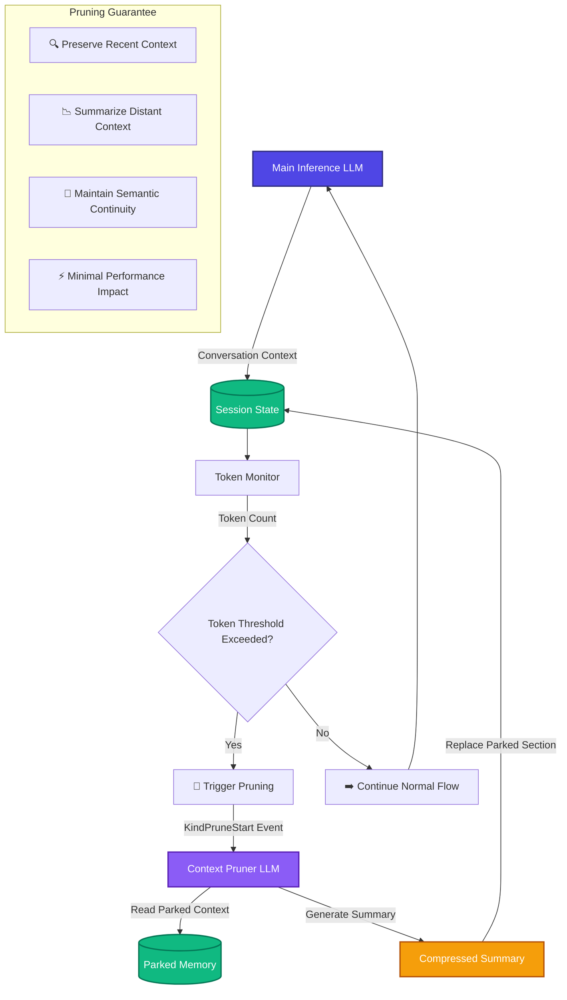
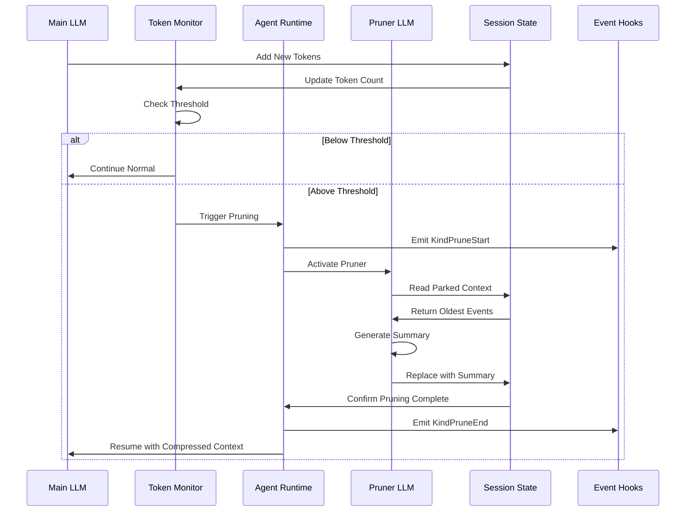
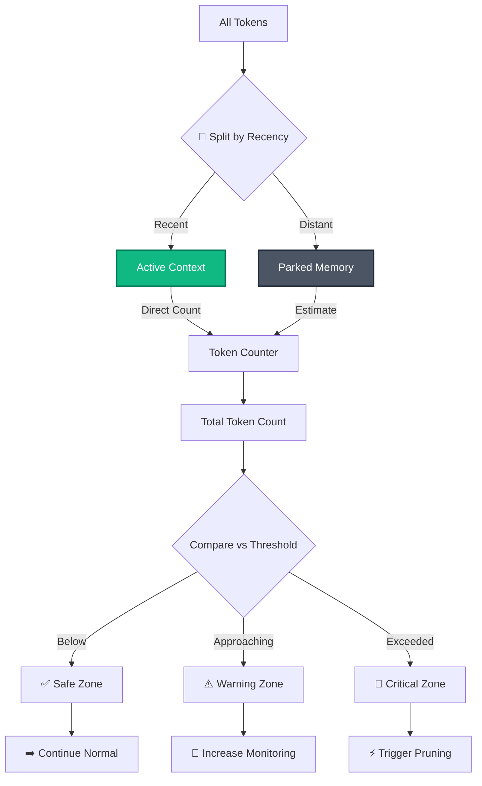
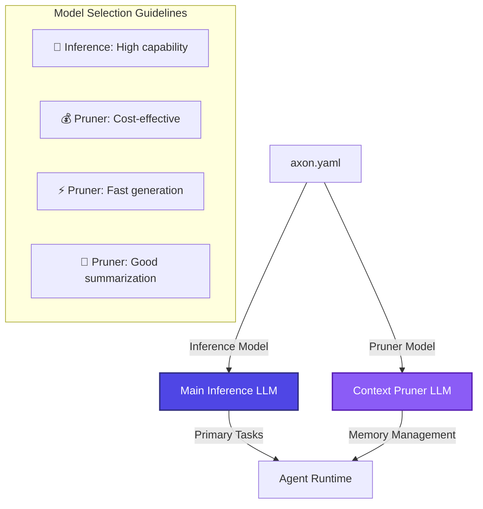
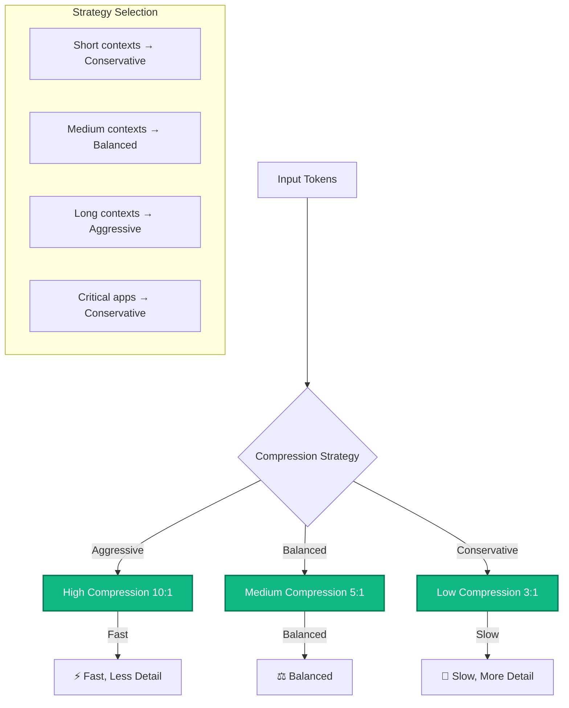
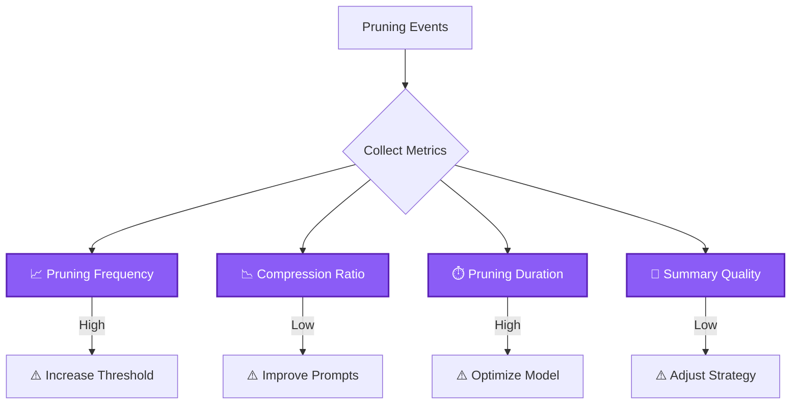

# Context Pruning & Memory Management

Axon's context pruning system uses a secondary LLM to intelligently compress conversation history when context windows approach their limits, enabling infinite-length conversations with bounded memory usage.

## 🎯 Hero Diagram: Dual-LLM Pruning Architecture



## 🔄 Detailed Flow: Pruning Activation Sequence



## 📊 Token Management System

### Token Counting Strategy


### Threshold Configuration
```yaml
# Example configuration in axon.yaml
model:
  openrouter/deepseek-v3.2:
    context_window: 128000  # Model's maximum context
    pruning:
      threshold: 100000     # Trigger pruning at 100k tokens
      target: 80000         # Target size after pruning
      strategy: "semantic"  # semantic, recency, or hybrid
      preserve_recent: 20   # Preserve last 20 messages
```

## 🤖 Pruner LLM Configuration

### Dual-LLM Architecture


### Pruner Prompt Engineering
```markdown
# Pruner System Prompt
You are a context summarizer. Your task is to compress old conversation history while preserving key information.

## Instructions:
1. Read the provided conversation history (oldest messages)
2. Identify key information, decisions, and facts
3. Create a concise summary that preserves:
   - Important facts and data
   - Key decisions made
   - Constraints and requirements
   - Unresolved questions
4. Output ONLY the summary, no additional commentary

## Example:
Input: [20 messages about file system operations]
Output: User was exploring the project structure, found configuration files in ./config/, discovered missing dependencies, and is working on setting up a development environment.
```

## 🔧 Implementation Details

### Pruning Algorithm
```go
// Simplified pruning implementation
func (a *Agent) triggerPruning(ctx context.Context) error {
    // 1. Emit pruning start event
    a.emit(ctx, Event{Kind: KindPruneStart})
    
    // 2. Identify events to compress
    events := a.session.Events()
    preserveCount := a.config.PreserveRecentMessages
    toCompress := events[:len(events)-preserveCount]
    toPreserve := events[len(events)-preserveCount:]
    
    // 3. Generate summary using pruner LLM
    summary, err := a.pruner.Summarize(ctx, toCompress)
    if err != nil {
        a.emit(ctx, Event{Kind: KindError, Err: err})
        return err
    }
    
    // 4. Replace compressed events with summary
    compressedEvents := []Event{
        {
            Kind:      KindSummary,
            Text:      summary,
            Timestamp: time.Now(),
        },
    }
    
    // 5. Rebuild session with compressed events
    newEvents := append(compressedEvents, toPreserve...)
    a.session.ReplaceEvents(newEvents)
    
    // 6. Emit pruning end event
    a.emit(ctx, Event{Kind: KindPruneEnd})
    
    return nil
}
```

**References:**
- `agent.go:55-65` - `SetPrunerModel()` method
- Complete pruner implementation in `pruner.go`
- Token counting and threshold detection

## 📈 Performance Optimization

### Compression Ratio Strategy


### Caching Mechanism
```go
// Summary cache to avoid redundant pruning
type SummaryCache struct {
    cache *lru.Cache
    hits  atomic.Int64
    misses atomic.Int64
}

func (sc *SummaryCache) GetOrCompute(events []Event, compute func([]Event) (string, error)) (string, error) {
    // Generate cache key from event fingerprints
    key := generateFingerprint(events)
    
    // Check cache
    if cached, found := sc.cache.Get(key); found {
        sc.hits.Add(1)
        return cached.(string), nil
    }
    
    // Compute summary
    sc.misses.Add(1)
    summary, err := compute(events)
    if err != nil {
        return "", err
    }
    
    // Cache result
    sc.cache.Add(key, summary)
    
    return summary, nil
}
```

## 🧪 Examples & Usage

### Basic Pruner Configuration
```go
package main

import (
    "context"
    "log"
    
    "github.com/atakang7/axon/v2"
)

func main() {
    settings, err := axon.Load()
    if err != nil {
        log.Fatal(err)
    }
    
    // Main inference model (powerful but expensive)
    mainModel, err := settings.NewClient("openrouter", "deepseek/deepseek-v3.2")
    if err != nil {
        log.Fatal(err)
    }
    
    // Pruner model (cheap and fast)
    prunerModel, err := settings.NewClient("openrouter", "mistralai/mistral-7b")
    if err != nil {
        log.Fatal(err)
    }
    
    config := axon.Config{
        Model: mainModel,
        Settings: settings,
        PruningConfig: axon.PruningConfig{
            PrunerModel: prunerModel,
            ThresholdTokens: 100000,
            TargetTokens: 80000,
            PreserveRecentMessages: 20,
            CompressionRatio: 5, // 5:1 compression
        },
    }
    
    ag, err := axon.New(config)
    if err != nil {
        log.Fatal(err)
    }
    defer ag.Close()
    
    // Use agent as normal - pruning happens automatically
    ctx := context.Background()
    response, _ := ag.Step(ctx, "Start a long conversation...")
    log.Printf("Response: %s", response)
}
```

### Custom Pruning Strategy
```go
// Implement custom pruning logic
type CustomPruner struct {
    model axon.LLMClient
}

func (cp *CustomPruner) Summarize(ctx context.Context, events []axon.Event) (string, error) {
    // Custom summarization logic
    messages := []axon.Message{
        {
            Role: "system",
            Content: `You are an expert technical summarizer. 
                     Focus on preserving:
                     1. Code snippets and examples
                     2. Configuration decisions
                     3. Error patterns and solutions
                     4. Architecture discussions`,
        },
        {
            Role: "user",
            Content: buildConversationText(events),
        },
    }
    
    response, err := cp.model.Chat(ctx, messages)
    if err != nil {
        return "", err
    }
    
    return response, nil
}

// Register custom pruner
config := axon.Config{
    PruningConfig: axon.PruningConfig{
        CustomPruner: &CustomPruner{model: prunerModel},
    },
}
```

## 📊 Monitoring & Observability

### Pruning Metrics Dashboard


### Health Checks
```go
// Monitor pruning health
func CheckPruningHealth(ag *axon.Agent) axon.PruningHealth {
    session := ag.Session()
    config := ag.Config().PruningConfig
    
    health := axon.PruningHealth{
        TotalTokens: session.TokenCount(),
        Threshold: config.ThresholdTokens,
        Remaining: config.ThresholdTokens - session.TokenCount(),
        PruneCount: session.PruneCount(),
        LastPruneTime: session.LastPruneTime(),
    }
    
    // Calculate health score
    if health.TotalTokens > config.ThresholdTokens {
        health.Status = "CRITICAL"
        health.Score = 0
    } else if health.TotalTokens > config.ThresholdTokens * 0.8 {
        health.Status = "WARNING"
        health.Score = 50
    } else {
        health.Status = "HEALTHY"
        health.Score = 100
    }
    
    return health
}
```

## 🔍 Debugging & Troubleshooting

### Common Issues
```go
// Debug function for pruning issues
func DebugPruning(ag *axon.Agent) {
    fmt.Println("=== Pruning Debug ===")
    
    // Check token counts
    session := ag.Session()
    fmt.Printf("Total tokens: %d\n", session.TokenCount())
    fmt.Printf("Active tokens: %d\n", session.ActiveTokenCount())
    fmt.Printf("Parked tokens: %d\n", session.ParkedTokenCount())
    
    // Check pruning configuration
    config := ag.Config().PruningConfig
    fmt.Printf("Threshold: %d\n", config.ThresholdTokens)
    fmt.Printf("Target: %d\n", config.TargetTokens)
    fmt.Printf("Preserve recent: %d messages\n", config.PreserveRecentMessages)
    
    // Check pruning history
    fmt.Printf("Total prunes: %d\n", session.PruneCount())
    fmt.Printf("Last prune: %v\n", session.LastPruneTime())
    
    // Recommendations
    if session.TokenCount() > config.ThresholdTokens {
        fmt.Println("⚠️ Warning: Above threshold, pruning should have triggered")
        fmt.Println("   Check: pruner model configuration, event hooks")
    }
}
```

## 📚 Related Documentation

- **[Core Architecture Deep Dive](../overview/architecture)** - System overview
- **[Deterministic State Management](../concepts/state-management)** - Event log details
- **[Session & Event System](../concepts/session-events)** - Event types and hooks
- **[Configuration Management](../configuration/basics)** - Pruning configuration

## 🚧 Best Practices

1. **Model Selection** - Choose cost-effective models for pruner
2. **Threshold Tuning** - Set thresholds based on your use case
3. **Quality Monitoring** - Regularly check summary quality
4. **Performance Testing** - Test pruning under load
5. **Fallback Strategy** - Have fallback for pruning failures

## ⚠️ Common Pitfalls

| Pitfall | Solution |
|---------|----------|
| Pruning too aggressive | Increase preserve_recent count |
| Summary loses key info | Improve pruner prompt engineering |
| Pruning too frequent | Increase threshold tokens |
| Performance impact | Use faster/smaller pruner model |
| Semantic drift | Add quality validation checks |

---

*Last updated: $(date)*  
*Code references: pruner.go, agent.go (SetPrunerModel), session.go*  
*Related concepts: Token Management, Memory Optimization, Dual-LLM Architecture*