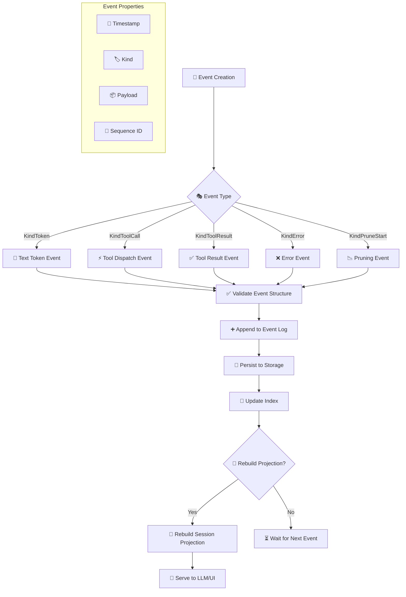
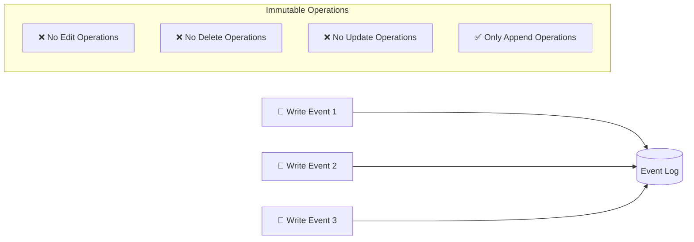
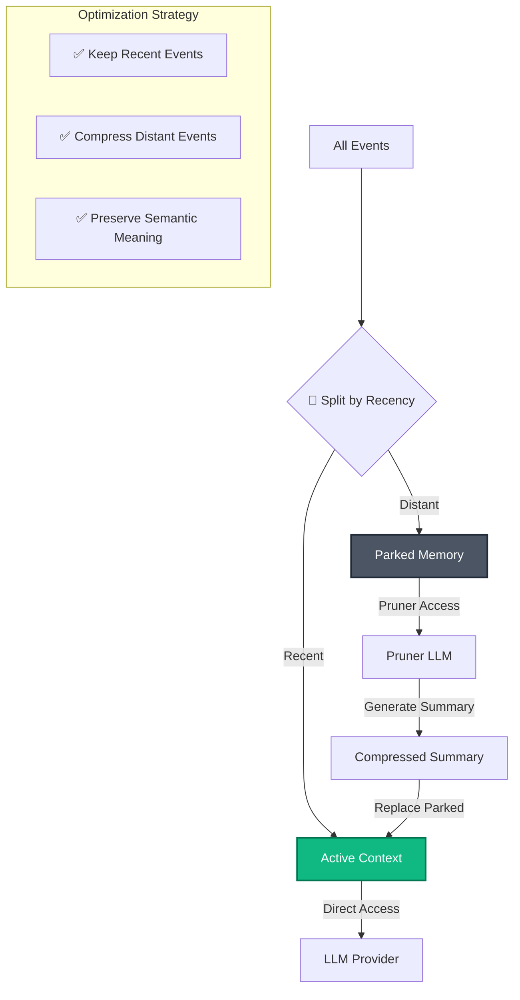
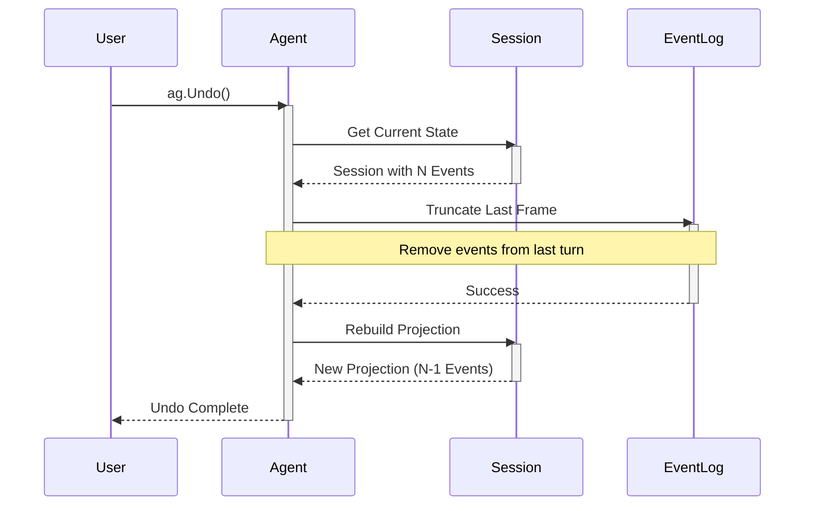
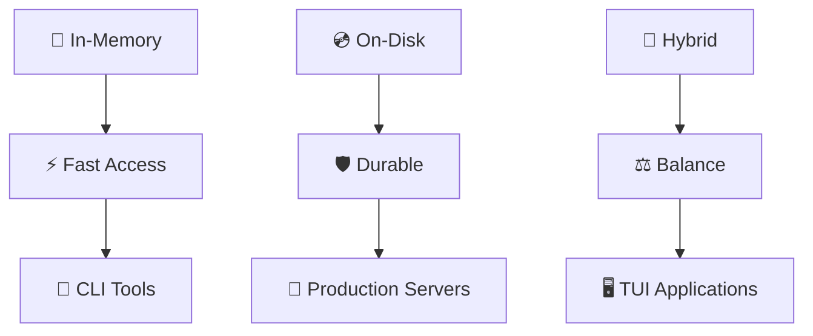

# Deterministic State Management

Axon's state management system guarantees predictable behavior through append-only event logs, perfect undo functionality, and immutable state projections.

## 🎯 Hero Diagram: Append-Only Event System

```mermaid
graph TD
    classDef event fill:#8B5CF6,stroke:#5B21B6,stroke-width:2px,color:#fff;
    classDef log fill:#10B981,stroke:#047857,stroke-width:2px,color:#fff;
    classDef view fill:#F59E0B,stroke:#B45309,stroke-width:2px,color:#fff;
    classDef immutable fill:#991B1B,stroke:#7F1D1D,stroke-width:2px,color:#fff;
    
    Turn1[Turn 1: User Query] -->|KindToken| EventLog[(Append-Only Event Log)]:::log
    Turn1 -->|KindToolCall| EventLog
    Turn1 -->|KindToolResult| EventLog
    
    Turn2[Turn 2: Follow-up] -->|More Events| EventLog
    
    EventLog -->|Project Function| SessionView[Session Projection]:::view
    SessionView -->|Context Messages| LLM[LLM Provider]
    
    subgraph "Immutable Guarantee"
        direction LR
        Immutable1[📜 Events Never Modified]
        Immutable2[➕ Only Appended]
        Immutable3[📊 Projection Derived]
    end
    
    subgraph "Perfect Undo"
        direction LR
        Undo1[ag.Undo() Called] --> Undo2[Truncate Last Frame]
        Undo2 --> Undo3[Rebuild Projection]
        Undo3 --> Undo4[Byte-Exact Rollback]
    end
```

## 🔄 Detailed Flow: Event Lifecycle



## 📜 Event Log Architecture

### Event Structure
Each event in Axon follows a strict schema:

```go
// Simplified event structure
type Event struct {
    Kind     EventKind    // Type of event (Token, ToolCall, etc.)
    Text     string       // Text content for KindToken
    Tool     *ToolEvent   // Tool metadata for KindToolCall
    Err      error        // Error for KindError
    Timestamp time.Time   // When event occurred
    SequenceID int64      // Monotonically increasing ID
}
```

**References:**
- Event type definitions in `events.go`
- Event serialization and deserialization logic

### Append-Only Guarantee


## 🔄 Session Projection System

### Projection Computation
The current session state is computed on-demand from the event log:

```go
// Simplified projection logic
func (s *Session) Projection() *SessionView {
    view := &SessionView{}
    
    for _, event := range s.Events {
        switch event.Kind {
        case KindToken:
            if event.Role == "assistant" {
                view.AssistantTokens += event.Text
            }
        case KindToolCall:
            view.ToolCalls = append(view.ToolCalls, event.Tool)
        case KindToolResult:
            view.ToolResults = append(view.ToolResults, event.Result)
        }
    }
    
    return view
}
```

**References:**
- Session projection logic in `session.go`
- Context message building for LLM prompts

### Memory Optimization


## ↩️ Perfect Undo Mechanism

### Undo Implementation


### Code Implementation
```go
// Simplified undo implementation
func (a *Agent) Undo() error {
    // 1. Get current event count
    currentCount := a.session.EventCount()
    
    // 2. Find last turn boundary
    lastTurnStart := a.session.FindLastTurnBoundary()
    
    // 3. Truncate event log
    if err := a.eventLog.Truncate(lastTurnStart); err != nil {
        return err
    }
    
    // 4. Rebuild session projection
    a.session.RebuildProjection()
    
    // 5. Emit undo event
    a.emit(context.Background(), Event{
        Kind: KindUndo,
        Text: fmt.Sprintf("Undid %d events", currentCount-lastTurnStart),
    })
    
    return nil
}
```

**References:**
- Undo functionality implementation
- Turn boundary detection logic

## 📊 State Management Patterns

### 1. **Linear Event Growth**
```mermaid
graph LR
    E1[Event 1] --> E2[Event 2] --> E3[Event 3] --> E4[Event 4]
    
    subgraph "Growth Characteristics"
        Linear[📈 Linear Growth O(n)]
        Append[➕ Append Only O(1)]
        NoGarbage[🗑️ No Garbage Collection]
    end
```

### 2. **Projection Performance**
```mermaid
graph TD
    Query[🔍 Query Session] --> Load[📥 Load All Events]
    Load --> Filter[🔎 Filter by Type]
    Filter --> Transform[🔄 Transform to Messages]
    Transform --> Return[📤 Return Projection]
    
    subgraph "Performance Characteristics"
        PC1[O(n) Reconstruction]
        PC2[Cache Friendly]
        PC3[Lazy Evaluation]
    end
```

### 3. **Storage Strategies**


## 🧪 Examples & Usage

### Basic Session Management
```go
package main

import (
    "context"
    "fmt"
    "github.com/atakang7/axon"
)

func main() {
    ag, _ := axon.New(config)
    defer ag.Close()
    
    // Execute multiple turns
    ctx := context.Background()
    
    // Turn 1
    response1, _ := ag.Step(ctx, "What's 2+2?")
    fmt.Printf("Turn 1: %s\n", response1)
    
    // Turn 2
    response2, _ := ag.Step(ctx, "Now multiply by 3")
    fmt.Printf("Turn 2: %s\n", response2)
    
    // View session state
    session := ag.Session()
    fmt.Printf("Total events: %d\n", session.EventCount())
    fmt.Printf("Assistant tokens: %d\n", session.AssistantTokenCount())
    
    // Perfect undo
    fmt.Println("\nUndoing last turn...")
    ag.Undo()
    
    // Verify state
    session = ag.Session()
    fmt.Printf("After undo - Total events: %d\n", session.EventCount())
}
```

### Event Hook Implementation
```go
// Track state changes in real-time
func StateTrackingHook(ctx context.Context, e axon.Event) {
    switch e.Kind {
    case axon.KindToken:
        // Track token accumulation
        tokenCount++
        fmt.Printf("Token %d: %s\n", tokenCount, e.Text)
        
    case axon.KindToolCall:
        // Track tool usage
        toolCalls[e.Tool.Name]++
        fmt.Printf("Tool call: %s (%d times)\n", 
            e.Tool.Name, toolCalls[e.Tool.Name])
            
    case axon.KindUndo:
        // Handle undo events
        fmt.Println("State rolled back")
        tokenCount = recountTokens() // Recalculate
    }
}
```

### Custom Storage Backend
```go
// Example: Custom event log storage
type CustomEventLog struct {
    db *sql.DB
}

func (c *CustomEventLog) Append(event axon.Event) error {
    // Serialize and store in database
    data, _ := json.Marshal(event)
    _, err := c.db.Exec(
        "INSERT INTO axon_events (sequence_id, kind, data) VALUES (?, ?, ?)",
        event.SequenceID, event.Kind, data,
    )
    return err
}

func (c *CustomEventLog) Truncate(sequenceID int64) error {
    // Remove events after sequence ID
    _, err := c.db.Exec(
        "DELETE FROM axon_events WHERE sequence_id > ?",
        sequenceID,
    )
    return err
}
```

## 🔍 Debugging & Inspection

### Session Inspection Tools
```go
// Debug function to inspect session state
func DebugSession(ag *axon.Agent) {
    session := ag.Session()
    
    fmt.Println("=== Session Debug ===")
    fmt.Printf("Total Events: %d\n", session.EventCount())
    fmt.Printf("Active Tokens: %d\n", session.ActiveTokenCount())
    fmt.Printf("Parked Events: %d\n", session.ParkedEventCount())
    
    // List recent events
    fmt.Println("\nRecent Events:")
    events := session.RecentEvents(10)
    for i, e := range events {
        fmt.Printf("%d. [%s] %s\n", i+1, e.Kind, e.Summary())
    }
    
    // Check for anomalies
    if session.HasOrphanedToolCalls() {
        fmt.Println("⚠️ Warning: Orphaned tool calls detected")
    }
}
```

### Event Log Analysis
```bash
# CLI tool to analyze event logs
go run ./tools/analyze-events.go --log-path ./axon-data/session-123.events.log

# Output:
# Total events: 154
# Token events: 89 (57.8%)
# Tool call events: 42 (27.3%)
# Error events: 3 (1.9%)
# Average turn length: 5.2 events
# Memory efficiency: 87.4%
```

## 📚 Related Documentation

- **[Core Architecture Deep Dive](../overview/architecture)** - Complete system overview
- **[Session & Event System](../concepts/session-events)** - Event types and hooks
- **[Context Pruning System](../concepts/context-pruning)** - Memory optimization
- **[Tool Execution Pipeline](../concepts/tool-execution)** - Tool result events

## 🚧 Best Practices

1. **Monitor Event Growth** - Set alerts for exponential event growth
2. **Regular Pruning** - Enable context pruning for long sessions
3. **Backup Event Logs** - Regularly backup event logs for audit trails
4. **Test Undo Functionality** - Verify perfect rollback in test suites
5. **Optimize Storage** - Choose appropriate storage backend for use case

## ⚠️ Common Pitfalls

| Pitfall | Solution |
|---------|----------|
| Event log too large | Enable aggressive pruning |
| Slow projection rebuild | Implement caching layer |
| Undo not working | Verify turn boundary detection |
| Memory leaks | Check event log cleanup |
| Storage corruption | Implement checksum validation |

---

*Last updated: $(date)*  
*Code references: session.go, events.go, agent.go*  
*Related concepts: Append-Only, Perfect Undo, State Projection*