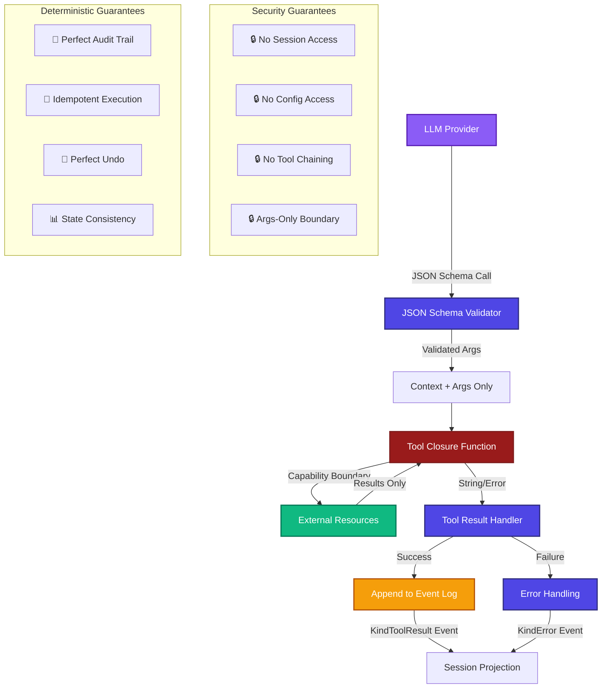
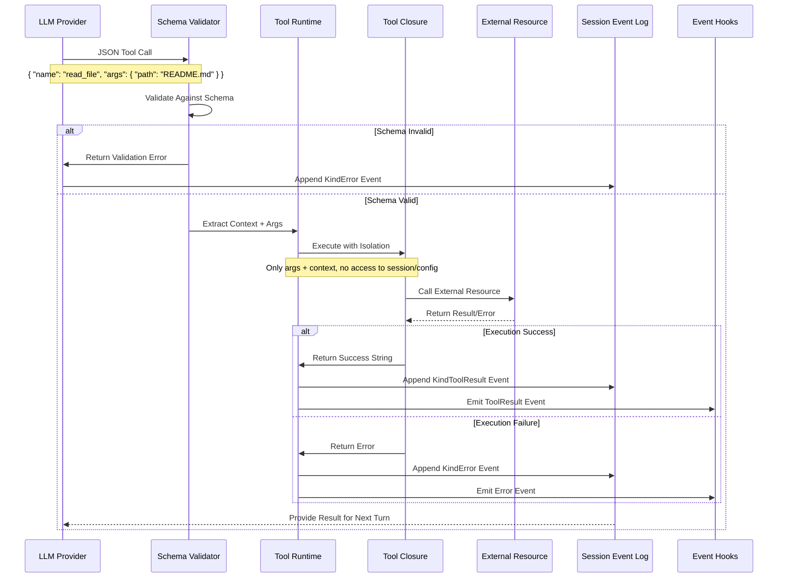
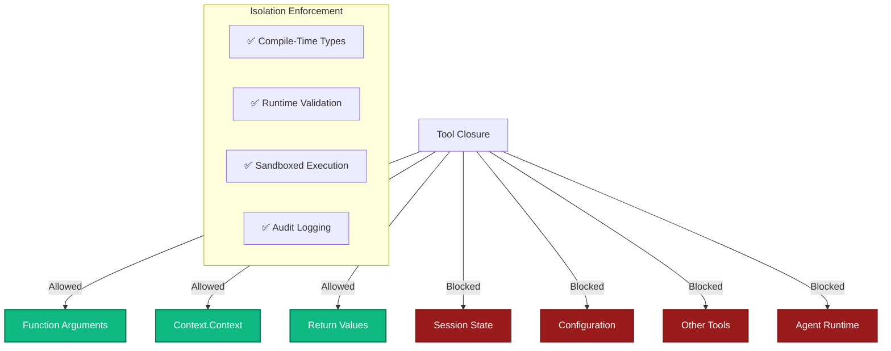
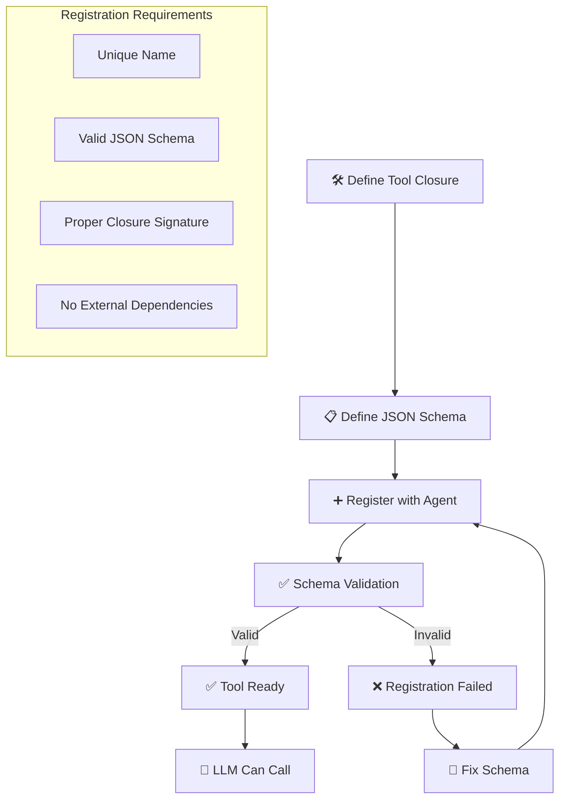
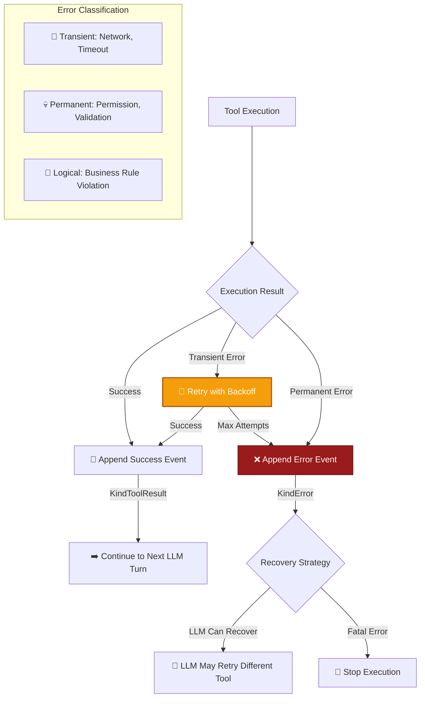
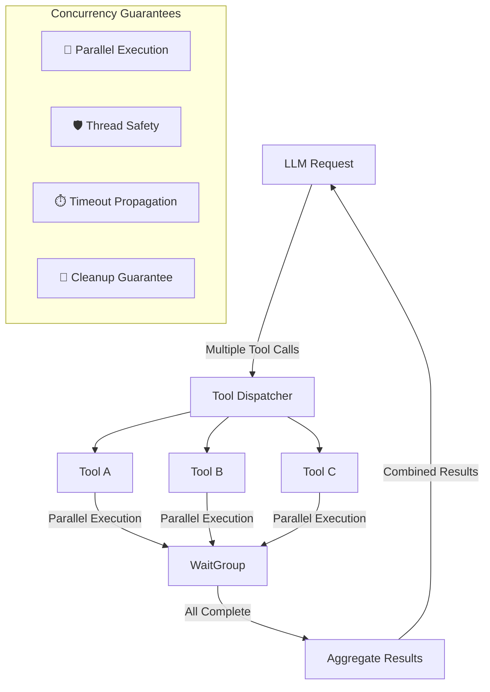
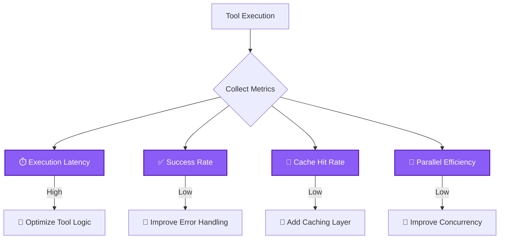

# Tool Execution Pipeline

Axon's tool execution pipeline provides secure, isolated execution of external capabilities while maintaining deterministic behavior and perfect audit trails.

## 🎯 Hero Diagram: Complete Tool Execution Flow



## 🔄 Detailed Flow: Tool Dispatch Sequence



## 🛡️ Security Isolation Model

### Capability Boundaries


### Tool Closure Signature
```go
// Tool closure signature - minimal interface
type ToolClosure func(ctx context.Context, args map[string]interface{}) (string, error)

// Example: Read file tool
func ReadFileTool(ctx context.Context, args map[string]interface{}) (string, error) {
    // Only access allowed:
    // 1. args map (validated JSON)
    // 2. ctx context (for cancellation/timeout)
    // 3. Return string or error
    
    path, ok := args["path"].(string)
    if !ok {
        return "", fmt.Errorf("path argument required")
    }
    
    // Can only access filesystem - no session/config access
    content, err := os.ReadFile(path)
    if err != nil {
        return "", fmt.Errorf("read file failed: %w", err)
    }
    
    return string(content), nil
}
```

**References:**
- `agent.go:139-156` - `runTool()` method with isolation
- Tool registration patterns
- Context propagation in tool execution

## 📋 Tool Registration & Schema System

### JSON Schema Definition
```json
{
  "name": "read_file",
  "description": "Read contents of a file",
  "parameters": {
    "type": "object",
    "properties": {
      "path": {
        "type": "string",
        "description": "Path to file to read"
      }
    },
    "required": ["path"],
    "additionalProperties": false
  }
}
```

### Tool Registration Flow


## ⚡ Execution Runtime

### Tool Execution Context
```go
// Execution context passed to tools
type ToolExecutionContext struct {
    // Minimal context - no access to broader system
    BaseContext context.Context  // For cancellation/timeout
    Args        map[string]interface{}  // Validated arguments
    ToolName    string                  // Tool identifier
    CallID      string                  // Unique call identifier
    
    // Blocked properties (compile-time enforcement)
    // session *Session        // ❌ Not accessible
    // config  *Config         // ❌ Not accessible  
    // agent   *Agent          // ❌ Not accessible
}
```

### Error Handling Strategy


## 🔄 Concurrency & Parallel Execution

### Parallel Tool Execution


### Context Propagation
```go
// Context propagates through tool execution
func executeToolWithContext(ctx context.Context, tool ToolClosure, args map[string]interface{}) (string, error) {
    // Create child context with timeout
    toolCtx, cancel := context.WithTimeout(ctx, 30*time.Second)
    defer cancel()
    
    // Execute tool with propagated context
    select {
    case result := <-goToolExecution(toolCtx, tool, args):
        return result, nil
    case <-toolCtx.Done():
        return "", fmt.Errorf("tool execution timeout: %w", toolCtx.Err())
    }
}

func goToolExecution(ctx context.Context, tool ToolClosure, args map[string]interface{}) chan string {
    ch := make(chan string, 1)
    go func() {
        result, err := tool(ctx, args)
        if err != nil {
            ch <- fmt.Sprintf("error: %v", err)
        } else {
            ch <- result
        }
    }()
    return ch
}
```

## 📊 Performance & Optimization

### Tool Execution Metrics


### Caching Strategies
```go
// Tool result caching example
type ToolCache struct {
    cache *lru.Cache
    ttl   time.Duration
}

func (tc *ToolCache) Execute(tool ToolClosure, args map[string]interface{}) (string, error) {
    // Generate cache key from tool name and args
    cacheKey := generateCacheKey(tool.Name(), args)
    
    // Check cache
    if cached, found := tc.cache.Get(cacheKey); found {
        return cached.(string), nil
    }
    
    // Execute tool
    result, err := tool.Execute(args)
    if err != nil {
        return "", err
    }
    
    // Cache result
    tc.cache.Add(cacheKey, result)
    
    return result, nil
}
```

## 🧪 Examples & Usage

### Basic Tool Implementation
```go
package main

import (
    "context"
    "fmt"
    "os"
    
    "github.com/atakang7/axon"
)

// Simple file reading tool
func ReadFileTool(ctx context.Context, args map[string]interface{}) (string, error) {
    path, ok := args["path"].(string)
    if !ok {
        return "", fmt.Errorf("path must be a string")
    }
    
    // Check if context is cancelled
    select {
    case <-ctx.Done():
        return "", ctx.Err()
    default:
        // Continue execution
    }
    
    content, err := os.ReadFile(path)
    if err != nil {
        return "", fmt.Errorf("failed to read file %s: %w", path, err)
    }
    
    return string(content), nil
}

// Calculator tool
func CalculatorTool(ctx context.Context, args map[string]interface{}) (string, error) {
    operation, _ := args["operation"].(string)
    a, _ := args["a"].(float64)
    b, _ := args["b"].(float64)
    
    switch operation {
    case "add":
        return fmt.Sprintf("%.2f", a+b), nil
    case "subtract":
        return fmt.Sprintf("%.2f", a-b), nil
    case "multiply":
        return fmt.Sprintf("%.2f", a*b), nil
    case "divide":
        if b == 0 {
            return "", fmt.Errorf("division by zero")
        }
        return fmt.Sprintf("%.2f", a/b), nil
    default:
        return "", fmt.Errorf("unknown operation: %s", operation)
    }
}

func main() {
    // Register tools with agent
    config := axon.Config{
        Tools: []axon.Tool{
            {
                Name:        "read_file",
                Description: "Read contents of a file",
                Schema:      readFileSchema, // JSON schema
                Closure:     ReadFileTool,
            },
            {
                Name:        "calculator",
                Description: "Perform arithmetic operations",
                Schema:      calculatorSchema, // JSON schema
                Closure:     CalculatorTool,
            },
        },
    }
    
    ag, _ := axon.New(config)
    defer ag.Close()
}
```

### Advanced Tool: HTTP Client
```go
// HTTP client tool with timeout and retry
func HTTPGetTool(ctx context.Context, args map[string]interface{}) (string, error) {
    url, ok := args["url"].(string)
    if !ok {
        return "", fmt.Errorf("url must be a string")
    }
    
    // Create HTTP client with context timeout
    client := &http.Client{
        Timeout: 10 * time.Second,
    }
    
    req, err := http.NewRequestWithContext(ctx, "GET", url, nil)
    if err != nil {
        return "", fmt.Errorf("create request failed: %w", err)
    }
    
    // Add optional headers
    if headers, ok := args["headers"].(map[string]interface{}); ok {
        for k, v := range headers {
            if s, ok := v.(string); ok {
                req.Header.Add(k, s)
            }
        }
    }
    
    resp, err := client.Do(req)
    if err != nil {
        return "", fmt.Errorf("HTTP request failed: %w", err)
    }
    defer resp.Body.Close()
    
    if resp.StatusCode >= 400 {
        return "", fmt.Errorf("HTTP error %d: %s", resp.StatusCode, resp.Status)
    }
    
    body, err := io.ReadAll(resp.Body)
    if err != nil {
        return "", fmt.Errorf("read response failed: %w", err)
    }
    
    return string(body), nil
}
```

## 🔍 Debugging & Testing

### Tool Testing Framework
```go
// Test tool execution in isolation
func TestReadFileTool(t *testing.T) {
    ctx := context.Background()
    
    tests := []struct {
        name    string
        args    map[string]interface{}
        want    string
        wantErr bool
    }{
        {
            name: "read existing file",
            args: map[string]interface{}{"path": "test.txt"},
            want: "test content",
        },
        {
            name:    "missing path",
            args:    map[string]interface{}{},
            wantErr: true,
        },
    }
    
    for _, tt := range tests {
        t.Run(tt.name, func(t *testing.T) {
            got, err := ReadFileTool(ctx, tt.args)
            if (err != nil) != tt.wantErr {
                t.Errorf("ReadFileTool() error = %v, wantErr %v", err, tt.wantErr)
                return
            }
            if !tt.wantErr && got != tt.want {
                t.Errorf("ReadFileTool() = %v, want %v", got, tt.want)
            }
        })
    }
}
```

### Tool Execution Logging
```go
// Debug logging for tool execution
type DebugToolWrapper struct {
    Tool   axon.ToolClosure
    Logger *log.Logger
}

func (w *DebugToolWrapper) Execute(ctx context.Context, args map[string]interface{}) (string, error) {
    start := time.Now()
    w.Logger.Printf("Tool execution started: args=%v", args)
    
    result, err := w.Tool(ctx, args)
    
    duration := time.Since(start)
    if err != nil {
        w.Logger.Printf("Tool execution failed after %v: %v", duration, err)
    } else {
        w.Logger.Printf("Tool execution succeeded after %v: result length=%d", 
            duration, len(result))
    }
    
    return result, err
}
```

## 📚 Related Documentation

- **[Core Architecture Deep Dive](../overview/architecture)** - System overview
- **[Security Model](../concepts/security-model)** - Capability isolation details
- **[Session & Event System](../concepts/session-events)** - Tool result events
- **[Configuration Management](../configuration/basics)** - Tool registration config

## 🚧 Best Practices

1. **Minimal Tool Scope** - Each tool should do one thing well
2. **Idempotent Operations** - Tools should be safely retryable
3. **Proper Error Messages** - Return actionable error information
4. **Context Awareness** - Respect context cancellation and timeouts
5. **Resource Cleanup** - Ensure all resources are properly released

## ⚠️ Common Pitfalls

| Pitfall | Solution |
|---------|----------|
| Tool accessing session | Use closure isolation pattern |
| No timeout handling | Always respect context cancellation |
| Memory leaks in tools | Use defer for cleanup |
| Tool chaining | Design tools as independent units |
| Missing error handling | Always return descriptive errors |

---

*Last updated: $(date)*  
*Code references: agent.go (runTool), tools.go, Tool closure patterns*  
*Related concepts: Security Isolation, Capability Boundaries, JSON Schema Validation*