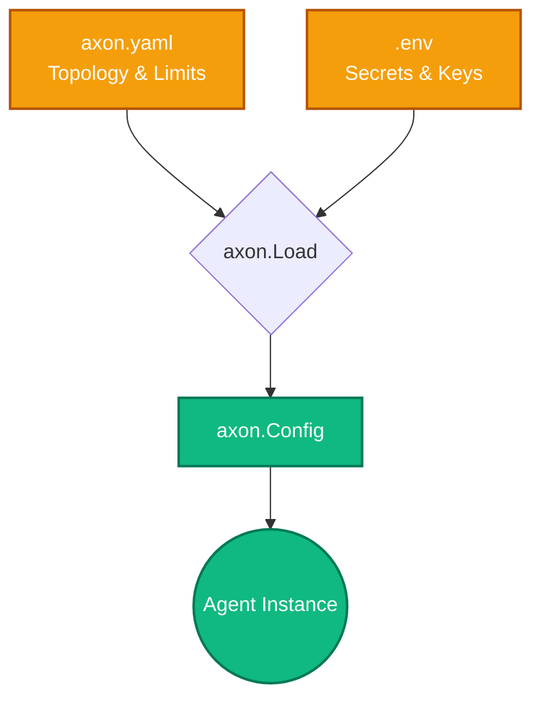

Axon enforces a strict decoupling of structural configuration (which is safe to version control) and secret material (which is environment-bound).



## Configuration Topology

The runtime expects two distinct files:

1. `axon.yaml`: Defines the topology. Which endpoints are available, token thresholds, and pruner configuration.
2. `.env`: Supplies the actual bearer tokens and database credentials.

### axon.yaml
```yaml
providers:
  openrouter:
    base_url: https://openrouter.ai/api
    api_key: ${OPENROUTER_API_KEY}
    models:
      deepseek/deepseek-v3.2:
        route: null
```

During `axon.Load()`, the runtime parses the YAML and strictly resolves any `${VAR}` references against the `.env` file or the OS environment. If a variable is missing, `Load()` panics or errors immediately. This fail-fast design prevents silent downstream HTTP 401s.

## Session Projection

Axon persists conversation history using an append-only event log (typically written to `AXON_DATA_DIR`). 

When you call `ag.Session()`, Axon reads the event log and builds an in-memory struct representing the *current* state of the conversation. 

Because memory is a projection and never mutated in place, state corruptions are impossible. Calling `ag.Undo()` simply truncates the final event frame from the log, perfectly reverting both the model's output and the resulting tool side-effects from the perspective of the prompt context.
