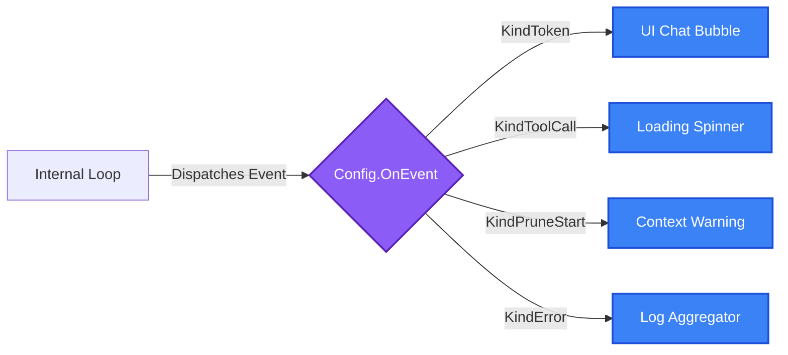

Axon is fundamentally a background orchestrator. To surface its behavior to a UI, a log aggregator, or a metrics pipeline, you must implement the `OnEvent` hook.



## The Event Loop

`Config.OnEvent` receives a synchronous callback for every state transition in the `ag.Step` loop. 

**Critical Requirement:** The `OnEvent` callback blocks the primary execution thread of the agent. Do not perform heavy synchronous I/O (like writing to a slow database) directly inside this closure. If you need to write to a slow sink, dispatch the event to a buffered channel.

### Example: Stdout Telemetry

```go
func LoggingCallback(ctx context.Context, e axon.Event) {
	switch e.Kind {
	case axon.KindToken:
		// Stream the assistant's standard text output.
		fmt.Print(e.Text)
		
	case axon.KindToolCall:
		// Log the intent to execute a tool.
		log.Printf("[DISPATCH] %s: %s\n", e.Tool.Name, e.Tool.Args)
		
	case axon.KindPruneStart:
		// Emit telemetry that the context window hit capacity.
		log.Println("[WARN] Token pressure critical. Invoking secondary pruner model.")
		
	case axon.KindError:
		// Catch HTTP stream failures or tool panics.
		log.Printf("[FATAL] %v\n", e.Error)
	}
}

// Attach during initialization:
config := axon.Config{
	Model:   model,
	OnEvent: LoggingCallback,
}
```

For the complete enumeration of event types, refer to the `Kind*` constants in `handler.go`.
