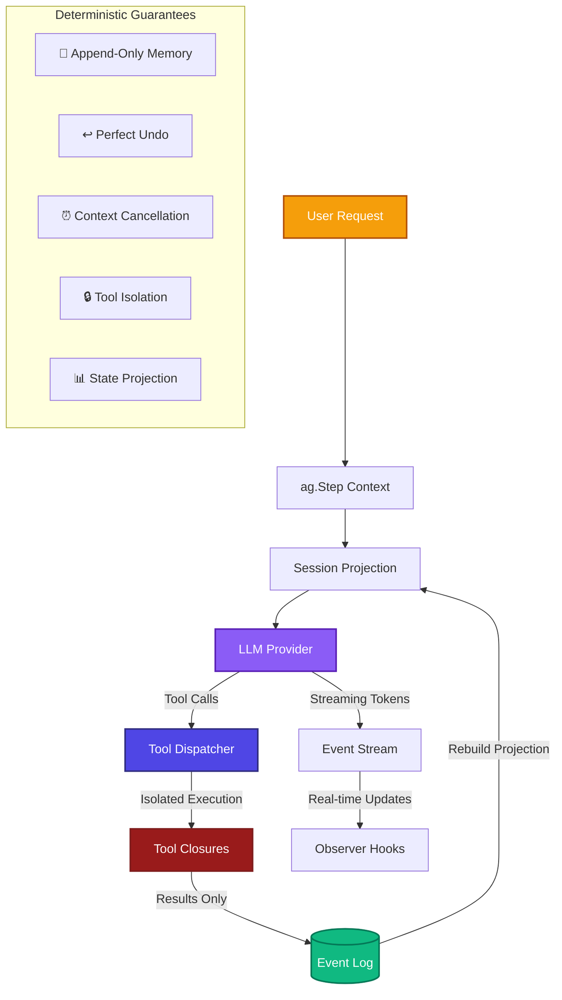
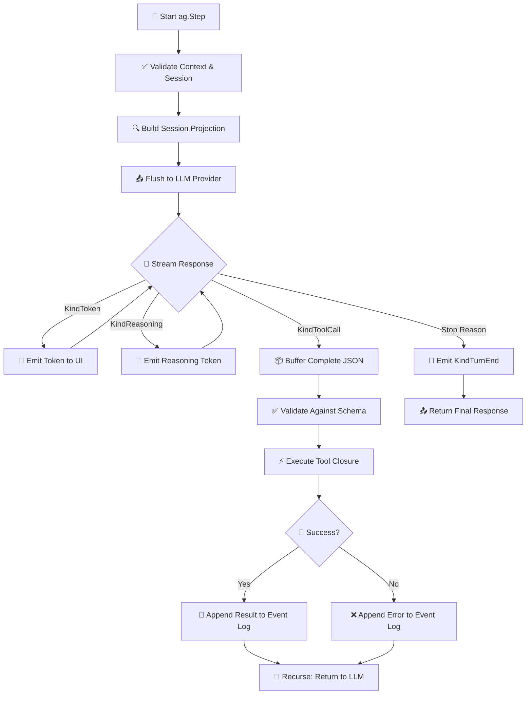
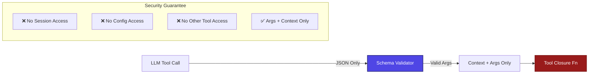
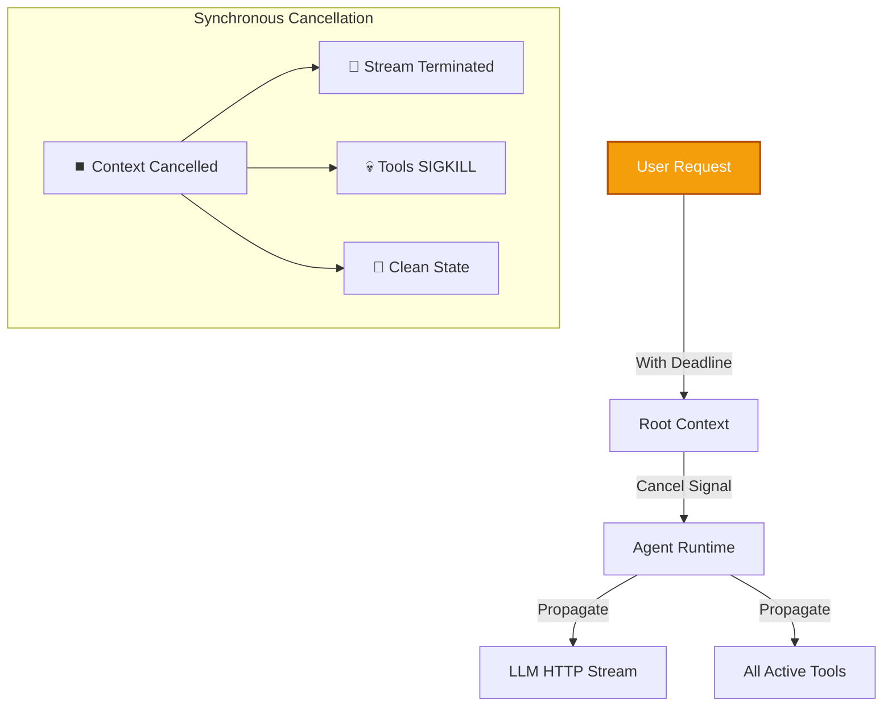

# Core Architecture Deep Dive

Axon's architecture is built around a deterministic state machine that guarantees predictable behavior, perfect audit trails, and robust error handling in production environments.

## 🎯 Hero Diagram: Complete System Architecture



## 🔄 Detailed Flow: Execution Sequence



## 🏗️ Core Architectural Components

### 1. **Agent (`agent.go`)**
The central orchestrator that manages the complete lifecycle of a turn.

**Key Methods:**
- `Step(ctx, input)` - Main entry point for user interactions
- `Interrupt()` - Cancel in-flight operations
- `Session()` - Get current session projection
- `Undo()` - Perfect rollback of last turn

**References:**
- `agent.go:16-48` - Agent struct definition
- `agent.go:81-137` - `chat()` method with retry logic
- `agent.go:139-156` - `runTool()` method with isolation

### 2. **Session System (`session.go`)**
Manages append-only event logs and session projections.

**Core Principles:**
- **Append-Only**: Events are never modified, only appended
- **Projection-Based**: Current state is computed from event log
- **Perfect Undo**: `ag.Undo()` truncates last frame exactly

**References:**
- Session struct in `session.go`
- Event log management and projection functions

### 3. **Pruner System (`pruner.go`)**
Secondary LLM that manages context window pressure.

**When Activated:**
- Token threshold exceeded in main context
- Stale conversation segments identified
- Memory compression needed for long sessions

**References:**
- `agent.go:55-65` - `SetPrunerModel()` method
- Complete pruner implementation in `pruner.go`

### 4. **Event System (`events.go`)**
Real-time telemetry and observability hooks.

**Event Types:**
- `KindToken` - Streaming text output
- `KindToolCall` - Tool dispatch events
- `KindError` - Runtime error notifications
- `KindPruneStart` - Context pruning activation

**References:**
- Event type definitions in `events.go`
- Event emission throughout the codebase

## 🔐 Security & Isolation Boundaries

### Tool Capability Isolation


### Context Propagation


## 📊 Performance Characteristics

### Token Management
- **Context Window**: Configurable token limits per provider
- **Pruning Threshold**: Automatic activation at configured limits
- **Memory Efficiency**: Compressed summaries for long sessions

### Concurrency Model
- **Parallel Tool Execution**: Multiple tools can execute concurrently
- **Synchronous Events**: Event hooks block main execution thread
- **Background Processes**: Managed via shell registry with cleanup

### State Management
- **Event Log Size**: Linear growth with conversation length
- **Projection Cost**: O(n) reconstruction from events
- **Undo Performance**: O(1) truncation operation

## 🚀 Integration Patterns

### Single Process (CLI Tools)
```go
// agent.go pattern for CLI tools
ag, _ := axon.New(config)
defer ag.Close()

response, _ := ag.Step(ctx, userInput)
```

### HTTP Server (REST API)
```go
// HTTP handler pattern
func handler(w http.ResponseWriter, r *http.Request) {
    ctx := r.Context()
    input := r.URL.Query().Get("q")
    
    response, err := ag.Step(ctx, input)
    if err != nil {
        http.Error(w, err.Error(), http.StatusInternalServerError)
        return
    }
    
    fmt.Fprintf(w, response)
}
```

### TUI Applications (Interactive)
```go
// TUI event loop pattern
for {
    input := tui.ReadInput()
    go func() {
        response, _ := ag.Step(ctx, input)
        tui.DisplayResponse(response)
    }()
}
```

## 🧪 Example: Complete Turn Lifecycle

```go
package main

import (
    "context"
    "fmt"
    "log"
    "time"
    
    "github.com/atakang7/axon"
)

func main() {
    // 1. Configuration
    settings, err := axon.Load()
    if err != nil {
        log.Fatal(err)
    }
    
    // 2. Model Client
    model, err := settings.NewClient("openrouter", "deepseek/deepseek-v3.2")
    if err != nil {
        log.Fatal(err)
    }
    
    // 3. Agent with Telemetry
    ag, err := axon.New(axon.Config{
        Model:   model,
        SystemPrompt: "You are a helpful assistant.",
        Settings: settings,
        OnEvent: func(ctx context.Context, e axon.Event) {
            switch e.Kind {
            case axon.KindToken:
                fmt.Print(e.Text) // Real-time streaming
            case axon.KindToolCall:
                log.Printf("Tool dispatched: %s", e.Tool.Name)
            }
        },
    })
    if err != nil {
        log.Fatal(err)
    }
    defer ag.Close()
    
    // 4. Execute with timeout
    ctx, cancel := context.WithTimeout(context.Background(), 30*time.Second)
    defer cancel()
    
    // 5. Single turn execution
    response, err := ag.Step(ctx, "List files in current directory")
    if err != nil {
        log.Fatal(err)
    }
    
    fmt.Printf("\nFinal response: %s\n", response)
    
    // 6. Perfect undo if needed
    if shouldUndo {
        ag.Undo() // Truncates last event frame exactly
    }
}
```

## 📚 Related Documentation

- **[Life of a Turn](../overview/life-of-a-turn)** - Detailed turn execution flow
- **[Deterministic State Management](../concepts/state-management)** - Append-only memory patterns
- **[Tool Execution Pipeline](../concepts/tool-execution)** - Capability isolation details
- **[Session & Event System](../concepts/session-events)** - Event logging and projection

## 🚧 Next Steps

1. **Explore Tool Definitions** to understand capability boundaries
2. **Configure Token Limits** for your specific LLM provider
3. **Implement Event Hooks** for real-time observability
4. **Test Undo Functionality** to verify perfect rollback

---

*Last updated: $(date)*  
*Code references: agent.go, session.go, pruner.go, events.go*  
*Related concepts: Deterministic State, Tool Isolation, Context Pruning*