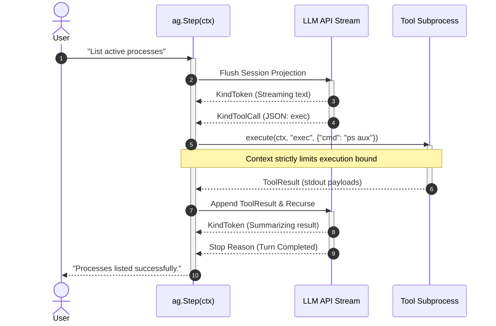

Understanding the lifecycle of `ag.Step(ctx, input)` is critical for writing robust integrations, especially when managing deadlines or handling telemetry.

When `Step` is invoked, Axon executes the following strict state machine:

## 1. Context Acquisition
The provided `context.Context` is anchored. Axon will monitor this context for cancellation throughout the entirety of the turn. If the context expires, Axon tears down the network stream and sends `SIGKILL` to active tool subprocesses.

## 2. API Streaming (`KindAPICall`)
Axon flushes the current session projection to the LLM provider as an array of messages. As the provider responds, Axon multiplexes the stream:
- **Reasoning Tokens:** Emitted immediately as `KindReasoning` events.
- **Content Tokens:** Emitted immediately as `KindToken` events.
- **Tool Dispatches:** Buffered until a complete JSON arguments payload is parsed.

## 3. Tool Execution (`KindToolCall`)
If the model requests tool execution, Axon pauses token generation.
- The runtime unmarshals the JSON payload and validates it against your defined schema.
- The tool's `Fn` closure is invoked synchronously, passing down the turn's `context.Context`.
- If the model dispatches multiple tools concurrently, Axon executes them in parallel via a wait group.

## 4. State Projection & Recurse
Once tools complete, their stdout/stderr payloads are appended to the event log. 
If tools were executed, Axon automatically recurses back to **Step 2**, returning the tool payloads to the model to evaluate the result.

## 5. Termination (`KindTurnEnd`)
The loop terminates, and `ag.Step` unblocks, returning the final assistant response string once the model yields a `stop` reason.
